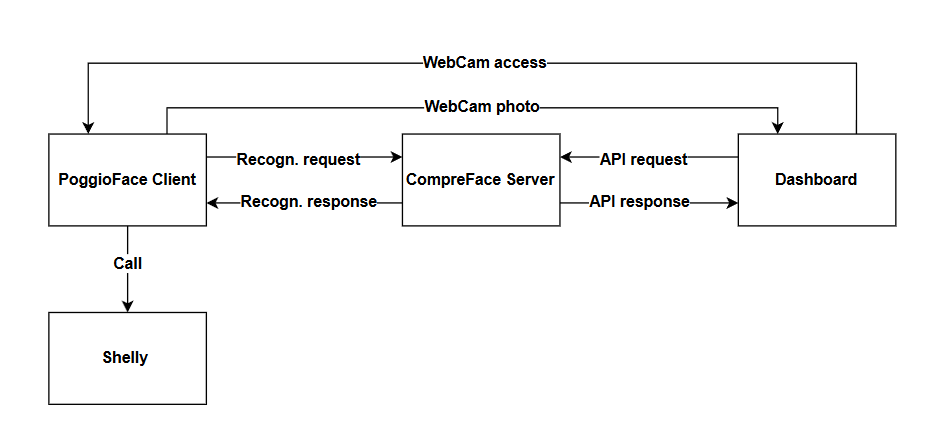

# PoggioFace - Sistema di Riconoscimento Facciale

## Indice
1. [Panoramica del Progetto](#1-panoramica-del-progetto)
2. [Architettura del Sistema](#2-architettura-del-sistema)
3. [Struttura dei File](#3-struttura-dei-file)
4. [Configurazione e Setup](#4-configurazione-e-setup)
5. [Componenti Principali](#5-componenti-principali)
6. [Dashboard Amministrativa](#6-dashboard-amministrativa)
7. [API e Endpoints](#7-api-e-endpoints)
8. [Integrazione Hardware (Shelly)](#8-integrazione-hardware-shelly)
9. [Troubleshooting](#9-troubleshooting)
10. [Avvio Automatico](#10-avvio-automatico)
11. [Autenticazione e Sicurezza](#11-autenticazione-e-sicurezza)

---

## 1. Panoramica del Progetto

**PoggioFace** è un sistema completo di riconoscimento facciale sviluppato in Python con Flask, progettato per il controllo degli accessi tramite riconoscimento biometrico. Il sistema utilizza **CompreFace** come motore di riconoscimento facciale e offre un'interfaccia web completa per la gestione dei soggetti e il monitoraggio in tempo reale.

Il sistema è stato implementato nel **Collegio di Merito IPE Poggiolevante**, per permettere a studenti e professionisti di accedere alla struttura utilizzando il loro volto.

### Caratteristiche Principali
- **Riconoscimento facciale in tempo reale** tramite webcam.
- **Dashboard amministrativa** per la gestione completa (CRUD) dei soggetti e delle loro immagini.
- **Cattura foto** sia da file locali che da webcam remota.
- **Integrazione hardware** con dispositivi Shelly per il controllo degli accessi (es. apertura porte).
- **Configurazione flessibile** tramite variabili d'ambiente.
- **Logging completo** delle operazioni sia sul backend che sul frontend.

---

## 2. Architettura del Sistema

Il sistema PoggioFace segue un'architettura modulare composta da due servizi principali che interagiscono con il motore di riconoscimento CompreFace.



### Flusso di Funzionamento

1.  **Riconoscimento**:
    *   L'applicazione `PoggioFace.py` cattura i frame video dalla webcam in tempo reale.
    *   I frame vengono inviati al server **CompreFace** per l'analisi e il riconoscimento.
    *   Se un volto viene riconosciuto con una somiglianza superiore alla soglia configurata, `PoggioFace.py` invia una richiesta HTTP a un dispositivo **Shelly**.
    *   Lo Shelly riceve il comando e attiva un relay, ad esempio per aprire una porta.

2.  **Gestione Soggetti**:
    *   La **Dashboard Amministrativa** (`Dashboard/dashboard.py`) fornisce un'interfaccia web per gestire i soggetti.
    *   Le operazioni CRUD (Creazione, Lettura, Aggiornamento, Eliminazione) vengono eseguite tramite chiamate API al server CompreFace.
    *   È possibile aggiungere immagini ai soggetti caricandole da file o scattando una foto in tempo reale tramite la webcam dell'applicazione `PoggioFace`, senza interrompere il servizio di riconoscimento grazie a `SharedVideoStreamer.py`.

---

## 3. Struttura dei File

```
PoggioFace/
├── .env                           # Variabili di configurazione (da creare)
├── PoggioFace.py                  # Applicazione principale per il riconoscimento
├── Dashboard/                     # Modulo dashboard amministrativa
│   ├── dashboard.py               # Backend della dashboard
│   ├── static/                    # File statici (CSS, JS, immagini) per la dashboard
│   └── templates/                 # Template HTML per la dashboard
├── static/                        # File statici per l'applicazione principale
├── templates/                     # Template HTML per l'applicazione principale
├── requirements.txt               # Dipendenze Python
├── Doc/                           # Documentazione
│   ├── Doc.md                     # Questo file
│   └── Image/
│       └── workflow.png           # Diagramma del workflow
└── tmp/                           # Directory per file temporanei (es. foto da webcam)
```

---

## 4. Configurazione e Setup

### 1. Ambiente Virtuale
È fondamentale creare un ambiente virtuale Python per isolare le dipendenze del progetto.

```bash
# Crea l'ambiente virtuale chiamato 'pogfac'
python -m venv pogfac

# Attiva l'ambiente virtuale
# Windows
pogfac\Scripts\activate.bat
# macOS / Linux
source pogfac/bin/activate
```

### 2. Installazione Dipendenze
Con l'ambiente virtuale attivo, installa tutte le librerie necessarie elencate nel file `requirements.txt`.

```bash
pip install -r requirements.txt
```

### 3. File di Configurazione `.env`
Crea un file `.env` nella root del progetto. Questo file conterrà tutte le variabili di configurazione necessarie per il funzionamento del sistema.

> **Nota:** Il file `.env` è l'unica fonte di configurazione ed è letto da tutti i componenti: PoggioFace, Dashboard e InsightFace Docker.

```env
# ============================================
# CONFIGURAZIONE CENTRALIZZATA POGGIOFACE
# ============================================

# --- Configurazione InsightFace ---
# L'indirizzo IP o il nome host dove è in esecuzione il server InsightFace
HOST=http://localhost
# La porta su cui InsightFace è in ascolto
PORT=8000
# La chiave API (opzionale - per retrocompatibilità)
API_KEY=your_api_key

# --- Soglie di Riconoscimento (0.0 - 1.0) ---
# Soglia minima di somiglianza per riconoscere un soggetto (più alto = più restrittivo)
SIMILARITY_THRESHOLD=0.5
# Soglia minima di probabilità per considerare un volto rilevato
DETECTION_THRESHOLD=0.5

# --- Plugin Facciali (opzionale) ---
# Plugin aggiuntivi da utilizzare (es. age, gender)
FACE_PLUGINS=age,gender

# --- Configurazione Hardware ---
# L'URL completo per attivare il relay del dispositivo Shelly (lasciare vuoto se non usato)
SHELLY_URL=

# --- Credenziali Dashboard ---
# La password per accedere alla dashboard amministrativa.
DASHBOARD_PASSWORD=your_secure_password
# Una chiave segreta per la gestione delle sessioni Flask
SECRET_KEY=your_flask_secret_key

# --- Configurazione Servizi Locali ---
# L'URL base dell'applicazione PoggioFace
POGGIO_FACE_URL=http://localhost:5002
# L'URL della Dashboard
DASHBOARD_URL=http://localhost:5000
```

> ⚠️ **IMPORTANTE:** Dopo aver modificato `SIMILARITY_THRESHOLD` o `DETECTION_THRESHOLD`, riavviare il container Docker (`docker-compose down && docker-compose up -d`) e i servizi Python.

### 4. Avvio delle Applicazioni
Il sistema è composto da due servizi che devono essere eseguiti in due terminali separati (con l'ambiente virtuale `pogfac` attivo in entrambi).

**Terminale 1: Applicazione di Riconoscimento**
```bash
python PoggioFace.py
# Servizio accessibile su http://localhost:5002
```

**Terminale 2: Dashboard Amministrativa**
```bash
cd Dashboard
python dashboard.py
# Servizio accessibile su http://localhost:5000
```

---

## 5. Componenti Principali

### Applicazione Principale (`PoggioFace.py`)
Questo è il cuore del sistema di riconoscimento.
- **Funzionalità**: Avvia la webcam, cattura i frame, li invia a CompreFace e gestisce l'interazione con l'hardware (Shelly).
- **Interfaccia**: Fornisce un'interfaccia web su `http://localhost:5002` che mostra il feed della webcam con overlay di riconoscimento.
- **Endpoint**: Espone endpoint per la configurazione (`/config`), il logging (`/log`) e l'attivazione dello Shelly (`/shelly_url`).

### Dashboard Amministrativa (`Dashboard/dashboard.py`)
Questo servizio fornisce un'interfaccia web completa per la gestione dei dati di riconoscimento. L'accesso è protetto da una password configurabile.
- **Funzionalità**: Permette di aggiungere, visualizzare, rinominare ed eliminare soggetti. Consente anche di gestire le immagini associate a ciascun soggetto.
- **Interfaccia**: La dashboard è accessibile su `http://localhost:5000`. All'accesso verrà presentata una pagina di login.
- **Endpoint**: Espone un'API RESTful per tutte le operazioni CRUD sui soggetti e sulle immagini. La maggior parte degli endpoint richiede l'autenticazione.

---

## 6. Dashboard Amministrativa

La dashboard è lo strumento principale per gestire la "memoria" del sistema di riconoscimento.

### Flusso di Cattura Foto Remota
Una delle funzionalità più potenti della dashboard è la possibilità di aggiungere un'immagine a un soggetto utilizzando la webcam dell'applicazione di riconoscimento (`PoggioFace`), senza interrompere il servizio.

1.  **Richiesta**: Dalla dashboard, l'utente clicca sul pulsante "Scatta con Webcam".
2.  **iFrame**: Viene aperto un modale che contiene un `<iframe>`. L'iframe carica la pagina `/capture_remote_photo` dall'applicazione `PoggioFace.py`.
3.  **Cattura**: L'utente scatta la foto all'interno dell'iframe.
4.  **Invio al Backend**: La foto catturata (in formato base64) viene inviata all'endpoint `/receive_remote_photo` della dashboard.
5.  **Salvataggio Temporaneo**: Il backend della dashboard salva l'immagine in una cartella temporanea (`/tmp`) e restituisce il percorso del file al frontend.
6.  **Aggiunta Soggetto/Immagine**: Il frontend della dashboard utilizza questo percorso temporaneo per completare la richiesta di aggiunta di un nuovo soggetto o di una nuova immagine.
7.  **Pulizia Automatica**: Dopo che l'immagine è stata caricata con successo su CompreFace, il backend della dashboard avvia un timer. **Dopo 10 secondi**, l'endpoint `/cleanup_temp` viene chiamato per eliminare il file temporaneo dalla cartella `/tmp`, garantendo che le immagini non occupino spazio inutilmente sul server.

---

## 7. API e Endpoints

### Endpoints Dashboard (`http://localhost:5000`)
| Metodo | Endpoint                      | Descrizione                               |
|--------|-------------------------------|-------------------------------------------|
| `GET`  | `/login`                      | Mostra la pagina di login.                |
| `POST` | `/login`                      | Gestisce il tentativo di login.           |
| `GET`  | `/logout`                     | Esegue il logout dell'utente.             |
| `GET`  | `/`                           | Mostra la pagina principale della dashboard. |
| `GET`  | `/subjects`                   | Lista tutti i soggetti e le loro immagini. |
| `POST` | `/subjects`                   | Aggiunge un nuovo soggetto.               |
| `PUT`  | `/subjects/<name>`            | Rinomina un soggetto esistente.           |
| `DELETE`| `/subjects/<name>`            | Elimina un soggetto e tutte le sue immagini.|
| `POST` | `/subjects/<name>/images`     | Aggiunge una nuova immagine a un soggetto. |
| `DELETE`| `/images/<id>`                | Elimina una singola immagine.             |
| `POST` | `/receive_remote_photo`       | Riceve e salva una foto dalla webcam remota.|
| `POST` | `/cleanup_temp`               | Pulisce la cartella dei file temporanei.  |

### Endpoints PoggioFace (`http://localhost:5002`)
| Metodo | Endpoint                  | Descrizione                                       |
|--------|---------------------------|---------------------------------------------------|
| `GET`  | `/`                       | Mostra l'interfaccia di riconoscimento facciale.  |
| `GET`  | `/config`                 | Fornisce la configurazione al frontend.           |
| `POST` | `/log`                    | Riceve messaggi di log dal frontend.              |
| `POST` | `/shelly_url`             | Attiva il dispositivo Shelly.                     |
| `GET`  | `/capture_remote_photo`   | Fornisce la pagina per la cattura remota.         |

---

## 8. Integrazione Hardware (Shelly)

L'integrazione con dispositivi hardware esterni come gli Shelly è un punto chiave del progetto per il controllo degli accessi.

### Configurazione
La configurazione avviene tramite la variabile `SHELLY_URL` nel file `.env`. È necessario inserire l'URL completo fornito dalla documentazione Shelly per attivare il relay desiderato.

**Esempio:**
```
SHELLY_URL=http://192.168.1.100/relay/0?turn=on
```

Se si vuole modificare la **configurazione dello shelly**, è necessario da broswer accedere alla sua dashboard cercando il suo indirizzo IP nella barra di ricerca.
Successivamente basta accedere alla sezione in foto:


---

## 9. Troubleshooting

#### La webcam non si avvia
- **Causa**: Permessi del browser non concessi.
- **Soluzione**: Assicurati di aver concesso al browser il permesso di accedere alla webcam per il sito `http://localhost:5002`.

#### Nessun soggetto viene riconosciuto
- **Causa**: Soglia di somiglianza troppo alta o immagini di scarsa qualità.
- **Soluzione**: Prova ad abbassare il valore di `SIMILARITY_THRESHOLD` nel file `.env`. Assicurati che i soggetti nella dashboard abbiano immagini chiare e ben illuminate.

#### Errore di connessione a CompreFace
- **Causa**: Il servizio CompreFace non è in esecuzione o le variabili `HOST` e `PORT` nel `.env` non sono corrette.
- **Soluzione**: Verifica che il container Docker di CompreFace sia attivo e controlla la configurazione nel file `.env`.

#### Lo Shelly non si attiva
- **Causa**: L'URL in `SHELLY_URL` è errato o il dispositivo non è raggiungibile sulla rete.
- **Soluzione**: Verifica che l'indirizzo IP dello Shelly sia corretto e che il dispositivo sia connesso alla stessa rete del server PoggioFace. Prova a chiamare l'URL direttamente da un browser per testarlo.

---

## 10. Avvio Automatico

Per garantire che i servizi siano sempre attivi all'accensione delle rispettive macchine, sono stati configurati degli script per l'avvio automatico.

### Dashboard Amministrativa
Sulla macchina che ospita la dashboard, lo script [`start_dashboard.sh`](start_dashboard.sh) viene eseguito all'avvio. Questo script si occupa di attivare l'ambiente virtuale Python e lanciare il server Flask della dashboard, rendendola immediatamente disponibile sulla rete.

### Servizio di Riconoscimento (PoggioFace)
Sul Raspberry Pi che gestisce il riconoscimento facciale, è presente uno script `startup_poggio.sh` (nella cartella `poggio-face`). Questo script viene eseguito al boot del sistema operativo e avvia l'applicazione [`PoggioFace.py`](PoggioFace.py), rendendo il sistema di riconoscimento immediatamente operativo senza necessità di intervento manuale.

---

## 11. Autenticazione e Sicurezza

L'accesso alla **Dashboard Amministrativa** è protetto per garantire che solo gli utenti autorizzati possano gestire i soggetti e le configurazioni.

### Pagina di Login
Quando si tenta di accedere all'URL della dashboard (`http://localhost:5000`), si viene reindirizzati a una pagina di login. È necessario inserire la password configurata per poter procedere.

### Configurazione Credenziali
La sicurezza della dashboard si basa su due variabili d'ambiente che devono essere definite nel file `.env`:

-   `DASHBOARD_PASSWORD`: Imposta la password per l'accesso.
-   `SECRET_KEY`: Una chiave crittografica utilizzata da Flask per firmare in modo sicuro i cookie di sessione. È fondamentale che sia un valore lungo, casuale e segreto.

Se queste variabili non sono impostate, l'applicazione non si avvierà correttamente.
