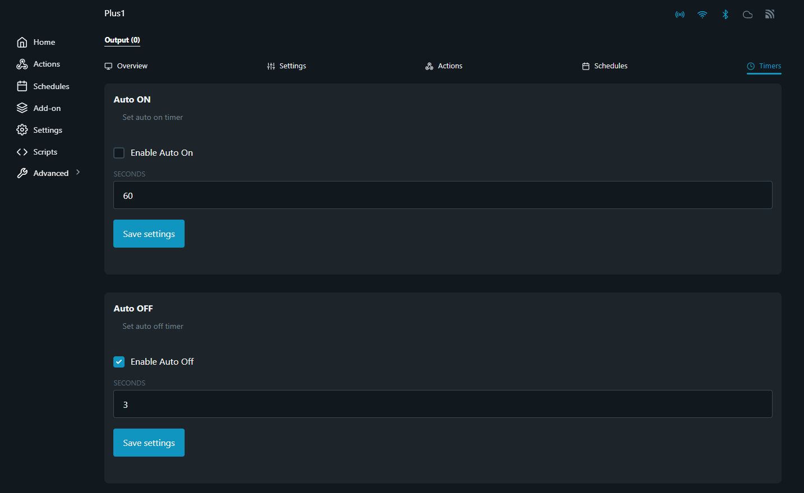

# PoggioFace - Sistema di Riconoscimento Facciale

## Indice
1. [Panoramica del Progetto](#1-panoramica-del-progetto)
2. [Architettura del Sistema](#2-architettura-del-sistema)
3. [Struttura dei File](#3-struttura-dei-file)
4. [Configurazione e Setup](#4-configurazione-e-setup)
5. [InsightFace Service (Docker)](#5-insightface-service-docker)
6. [Componenti Principali](#6-componenti-principali)
7. [Dashboard Amministrativa](#7-dashboard-amministrativa)
8. [API e Endpoints](#8-api-e-endpoints)
9. [Integrazione Hardware (Shelly)](#9-integrazione-hardware-shelly)
10. [Deployment Multi-Macchina](#10-deployment-multi-macchina)
11. [Troubleshooting](#11-troubleshooting)
12. [Avvio Automatico](#12-avvio-automatico)
13. [Autenticazione e Sicurezza](#13-autenticazione-e-sicurezza)

---

## 1. Panoramica del Progetto

**PoggioFace** è un sistema completo di riconoscimento facciale sviluppato in Python con Flask, progettato per il controllo degli accessi tramite riconoscimento biometrico. Il sistema utilizza **InsightFace** come motore di riconoscimento facciale (modello `buffalo_l` basato su ArcFace) e offre un'interfaccia web completa per la gestione dei soggetti e il monitoraggio in tempo reale.

Il sistema è stato implementato nel **Collegio di Merito IPE Poggiolevante**, per permettere a studenti e professionisti di accedere alla struttura utilizzando il loro volto.

> **📌 Nota sulla Migrazione:** Il sistema è stato migrato da CompreFace a InsightFace nel Dicembre 2025. Per dettagli tecnici sulla migrazione, consultare [MIGRATION_REPORT.md](../MIGRATION_REPORT.md).

### Caratteristiche Principali
- **Riconoscimento facciale in tempo reale** tramite webcam con modello InsightFace (ArcFace) in formato 16:9.
- **Motore di riconoscimento containerizzato** con Docker per facilità di deployment.
- **Dashboard amministrativa** per la gestione completa (CRUD) dei soggetti e delle loro immagini.
- **Log Riconoscimenti in tempo reale** con visualizzazione nella Dashboard e cancellazione automatica per privacy.
- **Cattura foto** sia da file locali che da webcam remota.
- **Integrazione hardware** con dispositivi Shelly per il controllo degli accessi (es. apertura porte).
- **Configurazione centralizzata** tramite file `.env` unico per tutti i componenti.
- **Supporto multi-macchina** per separare il servizio di riconoscimento dal client webcam.
- **Logging completo** delle operazioni sia sul backend che sul frontend.


---

## 2. Architettura del Sistema

Il sistema PoggioFace segue un'architettura modulare composta da tre componenti principali che possono essere distribuiti su macchine diverse.


```
┌─────────────────────────────────────────────────────────────┐
│                    MACCHINA SERVER (A)                      │
│  ┌─────────────────────────────────────────────────────┐    │
│  │              Docker Container                       │    │
│  │         InsightFace Service (FastAPI)               │    │
│  │              Porta: 8000                            │    │
│  │  ┌─────────────────────────────────────────────┐    │    │
│  │  │  buffalo_l model + ONNX Runtime (CPU/GPU)   │    │    │
│  │  │  Volume: ./data → /app/data                 │    │    │
│  │  └─────────────────────────────────────────────┘    │    │
│  └─────────────────────────────────────────────────────┘    │
│                                                             │
│  ┌─────────────────────────────────────────────────────┐    │
│  │              Dashboard Flask                        │    │
│  │              Porta: 5000                            │    │
│  │  - Gestione Subject                                 │    │
│  │  - Upload immagini volti                            │    │
│  │  - Interfaccia web amministrazione                  │    │
│  └─────────────────────────────────────────────────────┘    │
└─────────────────────────────────────────────────────────────┘
                           │
                    Rete Locale
                           │
┌─────────────────────────────────────────────────────────────┐
│                   MACCHINA CLIENT (B)                       │
│  ┌─────────────────────────────────────────────────────┐    │
│  │              PoggioFace.py (Flask)                  │    │
│  │              Porta: 5002                            │    │
│  │  - Cattura video webcam                             │    │
│  │  - Invio frame per riconoscimento                   │    │
│  │  - Visualizzazione risultati                        │    │
│  │  - Attivazione Shelly                               │    │
│  └─────────────────────────────────────────────────────┘    │
└─────────────────────────────────────────────────────────────┘
```

### Flusso di Funzionamento

1.  **Riconoscimento**:
    *   L'applicazione `PoggioFace.py` cattura i frame video dalla webcam in tempo reale.
    *   I frame vengono inviati al servizio **InsightFace** (containerizzato in Docker) per l'analisi e il riconoscimento.
    *   InsightFace rileva i volti, calcola gli embedding e li confronta con il database.
    *   Se un volto viene riconosciuto con una somiglianza superiore alla soglia configurata, `PoggioFace.py` invia una richiesta HTTP a un dispositivo **Shelly**.
    *   Lo Shelly riceve il comando e attiva un relay, ad esempio per aprire una porta.

2.  **Gestione Soggetti**:
    *   La **Dashboard Amministrativa** (`Dashboard/dashboard.py`) fornisce un'interfaccia web per gestire i soggetti.
    *   Le operazioni CRUD (Creazione, Lettura, Aggiornamento, Eliminazione) vengono eseguite tramite chiamate HTTP all'API InsightFace.
    *   È possibile aggiungere immagini ai soggetti caricandole da file o scattando una foto in tempo reale tramite la webcam dell'applicazione `PoggioFace`, senza interrompere il servizio di riconoscimento grazie a `SharedVideoStreamer.py`.

---

## 3. Struttura dei File

```
PoggioFace/
├── .env                           # Configurazione centralizzata (da creare)
├── PoggioFace.py                  # Client Flask per riconoscimento facciale
├── SharedVideoStreamer.py         # Gestione condivisa dello stream video
├── requirements.txt               # Dipendenze Python principali
├── MIGRATION_REPORT.md            # Report migrazione da CompreFace a InsightFace
├── README.md                      # Documentazione generale del progetto
│
├── Dashboard/                     # Modulo dashboard amministrativa
│   ├── dashboard.py               # Backend Flask della dashboard
│   ├── static/                    # File statici (CSS, JS)
│   │   ├── Dashboard.css
│   │   └── dashboard.js
│   ├── templates/                 # Template HTML
│   │   ├── dashboard.html
│   │   ├── login.html
│   │   └── Test_API.html
│   └── tmp/                       # File temporanei per upload
│
├── insightface_service/           # Servizio InsightFace (Docker)
│   ├── app.py                     # API FastAPI wrapper
│   ├── Dockerfile                 # Container con supporto GPU
│   ├── Dockerfile.cpu             # Container solo CPU
│   ├── docker-compose.yml         # Orchestrazione Docker
│   ├── requirements.txt           # Dipendenze Python del servizio
│   ├── README.md                  # Documentazione del servizio
│   └── data/                      # Persistenza dati
│       └── images/                # Immagini dei soggetti
│
├── static/                        # File statici per PoggioFace
│   ├── PoggioFace.css
│   └── PoggioFace.js
│
├── templates/                     # Template HTML per PoggioFace
│   ├── PoggioFace.html
│   ├── RemoteCapture.html
│   └── WebCamDemo.html
│
├── Doc/                           # Documentazione
│   ├── Doc.md                     # Questo file
│   └── Image/                     # Immagini documentazione
│
└── tmp/                           # File temporanei
```

---

## 4. Configurazione e Setup

### 1. Ambiente Virtuale
È fondamentale creare un ambiente virtuale Python per isolare le dipendenze del progetto.

```bash
# Crea l'ambiente virtuale chiamato 'pogfac'
python -m venv pogfac

# Attiva l'ambiente virtuale
# Windows (PowerShell)
.\pogfac\Scripts\Activate.ps1
# Windows (CMD)
pogfac\Scripts\activate.bat
# macOS / Linux
source pogfac/bin/activate
```

### 2. Installazione Dipendenze
Con l'ambiente virtuale attivo, installa tutte le librerie necessarie elencate nel file `requirements.txt`.

```bash
pip install -r requirements.txt
```

### 3. File di Configurazione `.env`

Il file `.env` nella root del progetto è **l'unica fonte di configurazione** per tutti i componenti:
- **PoggioFace** (client)
- **Dashboard** (server)
- **InsightFace Docker** (motore di riconoscimento)

Crea un file `.env` nella root del progetto con il seguente contenuto:

```env
# ============================================
# CONFIGURAZIONE CENTRALIZZATA POGGIOFACE
# ============================================
# Questo file è letto da: PoggioFace, Dashboard, InsightFace Docker
# ============================================

# --- Configurazione InsightFace ---
# L'indirizzo IP o il nome host dove è in esecuzione il server InsightFace
HOST=http://localhost
# La porta su cui InsightFace è in ascolto
PORT=8000
# La chiave API (opzionale - per autenticazione)
API_KEY=your_api_key

# --- Soglie di Riconoscimento (0.0 - 1.0) ---
# Soglia minima di somiglianza per riconoscere un soggetto (più alto = più restrittivo)
SIMILARITY_THRESHOLD=0.5
# Soglia minima di probabilità per considerare un volto rilevato
DETECTION_THRESHOLD=0.5

# --- Plugin Facciali (opzionale) ---
# Plugin aggiuntivi da utilizzare (es. age, gender)
FACE_PLUGINS=age,gender

# --- Configurazione Hardware ---
# L'URL completo per attivare il relay del dispositivo Shelly (lasciare vuoto se non usato)
SHELLY_URL=

# --- Credenziali Dashboard ---
# La password per accedere alla dashboard amministrativa
DASHBOARD_PASSWORD=your_secure_password
# Una chiave segreta per la gestione delle sessioni Flask
SECRET_KEY=your_flask_secret_key

# --- Configurazione Servizi ---
# L'URL base dell'applicazione PoggioFace
POGGIO_FACE_URL=http://localhost:5002
# L'URL della Dashboard
DASHBOARD_URL=http://localhost:5000
```

### Tuning Soglia Similarity

| Valore | Comportamento |
|--------|---------------|
| 0.4 | Permissivo (più falsi positivi) |
| 0.5 | Bilanciato (raccomandato) |
| 0.6 | Restrittivo |
| 0.7+ | Molto restrittivo (più falsi negativi) |

> ⚠️ **IMPORTANTE:** Dopo aver modificato `SIMILARITY_THRESHOLD` o `DETECTION_THRESHOLD`:
> 1. Riavviare il container Docker: `docker-compose down && docker-compose up -d`
> 2. Riavviare PoggioFace e Dashboard per ricaricare la configurazione

### 4. Avvio del Sistema

Il sistema è composto da tre servizi che devono essere avviati in ordine:

**Passo 1: Avviare InsightFace Service (Docker)**
```bash
cd insightface_service
docker-compose up -d
# Servizio API accessibile su http://localhost:8000
```

**Passo 2: Avviare la Dashboard (Terminale 1)**
```bash
cd Dashboard
python dashboard.py
# Servizio accessibile su http://localhost:5000
```

**Passo 3: Avviare PoggioFace (Terminale 2)**
```bash
python PoggioFace.py
# Servizio accessibile su http://localhost:5002
```

---

## 5. InsightFace Service (Docker)

Il motore di riconoscimento facciale è incapsulato in un container Docker che espone un'API REST compatibile con il formato CompreFace originale.

### Avvio del Servizio

**Con GPU (NVIDIA CUDA):**
```bash
cd insightface_service
docker-compose up -d insightface-api
```

**Solo CPU:**
```bash
cd insightface_service
docker-compose --profile cpu up -d insightface-api-cpu
```

### Configurazione Docker

Le variabili di ambiente nel `docker-compose.yml`:

| Variabile | Default | Descrizione |
|-----------|---------|-------------|
| `SIMILARITY_THRESHOLD` | 0.5 | Soglia minima per considerare un match valido (0.0-1.0) |
| `DETECTION_THRESHOLD` | 0.5 | Soglia probabilità detection volto (0.0-1.0) |
| `MODEL_NAME` | buffalo_l | Modello InsightFace (buffalo_l, buffalo_m, buffalo_s) |
| `DET_SIZE` | 640 | Dimensione immagine per detection (più alto = più preciso) |

### Persistenza Dati

Il container monta due volumi:
- `./data` → `/app/data` - Database embeddings e immagini soggetti
- `insightface_models` → `/root/.insightface` - Cache modelli (evita download ripetuti)

### Verifica Funzionamento

```bash
# Verifica stato servizio
curl http://localhost:8000/health

# Lista soggetti
curl http://localhost:8000/api/v1/recognition/subjects

# Log del container
docker logs insightface-api --tail 50
```

---

## 6. Componenti Principali

### Applicazione Client (`PoggioFace.py`)
Questo è il client che gestisce la webcam e il riconoscimento in tempo reale.

- **Funzionalità**: 
  - Cattura frame dalla webcam in formato 16:9 (1280x720)
  - Invia immagini all'API InsightFace per il riconoscimento
  - Visualizza risultati con overlay grafico
  - Attiva dispositivi Shelly al riconoscimento
  - Fornisce endpoint per cattura foto remota dalla Dashboard
  - **Sistema di Log Riconoscimenti** in memoria per tracciare i tentativi di accesso
- **Interfaccia**: Fornisce un'interfaccia web su `http://localhost:5002` che mostra il feed della webcam con overlay di riconoscimento.
- **Componente Condiviso**: Utilizza `SharedVideoStreamer.py` per condividere lo stream video tra riconoscimento e cattura foto.

### Dashboard Amministrativa (`Dashboard/dashboard.py`)
Questo servizio fornisce un'interfaccia web completa per la gestione dei dati di riconoscimento.

- **Funzionalità**: 
  - Gestione completa CRUD dei soggetti
  - Upload immagini da file locale
  - Cattura foto dalla webcam remota (PoggioFace)
  - Visualizzazione immagini associate ai soggetti
  - **Visualizzazione Log Riconoscimenti** in tempo reale con cancellazione automatica per privacy
- **Interfaccia**: Accessibile su `http://localhost:5000`. L'accesso è protetto da password.
- **Client HTTP**: Utilizza una classe `InsightFaceClient` interna per comunicare con l'API InsightFace via HTTP.

### InsightFace Service (`insightface_service/app.py`)
Servizio FastAPI containerizzato che fornisce l'API di riconoscimento facciale.

- **Modello**: `buffalo_l` (ArcFace) per encoding volti
- **Similarity**: Cosine similarity (0-1) per confronto embedding
- **Persistenza**: Database pickle per embedding + filesystem per immagini
- **API**: Compatibile con formato CompreFace per retrocompatibilità

---

## 7. Dashboard Amministrativa

La dashboard è lo strumento principale per gestire la "memoria" del sistema di riconoscimento.

### Funzionalità Principali

1. **Gestione Soggetti**
   - Visualizzazione lista completa
   - Aggiunta nuovi soggetti
   - Rinomina soggetti esistenti
   - Eliminazione soggetti (con tutte le immagini associate)

2. **Gestione Immagini**
   - Upload da file locale
   - Cattura da webcam remota
   - Visualizzazione immagini per soggetto
   - Eliminazione singole immagini

3. **Log Riconoscimenti**
   - Visualizzazione in tempo reale dei tentativi di riconoscimento
   - Informazioni visualizzate: soggetto, similarità, timestamp, stato (riconosciuto/fallito/sconosciuto)
   - **Cancellazione automatica per privacy** quando si esce dalla sezione o si chiude la pagina
   - I log NON vengono persistiti su disco

### Flusso di Cattura Foto Remota
Una delle funzionalità più potenti della dashboard è la possibilità di aggiungere un'immagine a un soggetto utilizzando la webcam dell'applicazione di riconoscimento (`PoggioFace`), senza interrompere il servizio.

1.  **Richiesta**: Dalla dashboard, l'utente clicca sul pulsante "Scatta con Webcam".
2.  **iFrame**: Viene aperto un modale che contiene un `<iframe>`. L'iframe carica la pagina `/capture_remote_photo` dall'applicazione `PoggioFace.py`.
3.  **Cattura**: L'utente scatta la foto all'interno dell'iframe.
4.  **Invio al Backend**: La foto catturata (in formato base64) viene inviata all'endpoint `/receive_remote_photo` della dashboard.
5.  **Salvataggio Temporaneo**: Il backend della dashboard salva l'immagine in una cartella temporanea (`/tmp`) e restituisce il percorso del file al frontend.
6.  **Aggiunta Soggetto/Immagine**: Il frontend della dashboard utilizza questo percorso temporaneo per completare la richiesta di aggiunta di un nuovo soggetto o di una nuova immagine.
7.  **Pulizia Automatica**: Dopo che l'immagine è stata caricata con successo, il backend della dashboard elimina il file temporaneo dalla cartella `/tmp`.

### Sistema Log Riconoscimenti (Privacy)

La funzionalità di visualizzazione log è progettata con un approccio **privacy-first**:

- I log sono memorizzati **solo in memoria** nel backend PoggioFace (max 100 entries)
- Quando l'utente esce dalla sezione Log → i log vengono cancellati automaticamente
- Quando l'utente cambia tab o minimizza → i log vengono cancellati
- Quando l'utente chiude/ricarica la pagina → i log vengono cancellati (via `sendBeacon`)
- **Nessuna traccia rimane** dopo la visualizzazione

Tipi di log registrati:
| Tipo | Descrizione | Icona |
|------|-------------|-------|
| `recognition` | Soggetto riconosciuto sopra soglia | ✅ Verde |
| `failed` | Volto rilevato ma sotto soglia | ⚠️ Giallo |
| `detection` | Volto rilevato senza match | ❌ Rosso |

---

## 8. API e Endpoints

### Endpoints InsightFace Service (`http://localhost:8000`)
| Metodo | Endpoint                               | Descrizione                               |
|--------|----------------------------------------|-------------------------------------------|
| `GET`  | `/health`                              | Stato del servizio                        |
| `GET`  | `/api/v1/recognition/status`           | Stato dettagliato                         |
| `POST` | `/api/v1/recognition/recognize`        | Riconoscimento 1:N di volti               |
| `GET`  | `/api/v1/recognition/subjects`         | Lista tutti i soggetti                    |
| `POST` | `/api/v1/recognition/subjects`         | Crea un nuovo soggetto                    |
| `DELETE`| `/api/v1/recognition/subjects/{name}` | Elimina un soggetto                       |
| `PUT`  | `/api/v1/recognition/subjects/{name}`  | Rinomina un soggetto                      |
| `GET`  | `/api/v1/recognition/faces`            | Lista tutti i volti                       |
| `POST` | `/api/v1/recognition/faces`            | Aggiunge un volto a un soggetto           |
| `DELETE`| `/api/v1/recognition/faces/{id}`      | Elimina un singolo volto                  |
| `GET`  | `/api/v1/recognition/faces/{id}/img`   | Ottiene l'immagine di un volto            |

### Endpoints Dashboard (`http://localhost:5000`)
| Metodo | Endpoint                      | Descrizione                               |
|--------|-------------------------------|-------------------------------------------|
| `GET`  | `/login`                      | Mostra la pagina di login.                |
| `POST` | `/login`                      | Gestisce il tentativo di login.           |
| `GET`  | `/logout`                     | Esegue il logout dell'utente.             |
| `GET`  | `/`                           | Mostra la pagina principale della dashboard. |
| `GET`  | `/subjects`                   | Lista tutti i soggetti e le loro immagini. |
| `POST` | `/subjects`                   | Aggiunge un nuovo soggetto.               |
| `PUT`  | `/subjects/<name>`            | Rinomina un soggetto esistente.           |
| `DELETE`| `/subjects/<name>`           | Elimina un soggetto e tutte le sue immagini.|
| `POST` | `/subjects/<name>/images`     | Aggiunge una nuova immagine a un soggetto. |
| `DELETE`| `/images/<id>`               | Elimina una singola immagine.             |
| `POST` | `/receive_remote_photo`       | Riceve e salva una foto dalla webcam remota.|
| `POST` | `/cleanup_temp`               | Pulisce la cartella dei file temporanei.  |

### Endpoints PoggioFace (`http://localhost:5002`)
| Metodo | Endpoint                  | Descrizione                                       |
|--------|---------------------------|---------------------------------------------------|
| `GET`  | `/`                       | Mostra l'interfaccia di riconoscimento facciale.  |
| `GET`  | `/config`                 | Fornisce la configurazione al frontend.           |
| `POST` | `/log`                    | Riceve messaggi di log dal frontend.              |
| `POST` | `/shelly_url`             | Attiva il dispositivo Shelly.                     |
| `GET`  | `/recognition_status`     | Stato del riconoscimento e dello stream.          |
| `POST` | `/start_recognition`      | Avvia il riconoscimento facciale.                 |
| `POST` | `/stop_recognition`       | Ferma il riconoscimento facciale.                 |
| `GET`  | `/capture_remote_photo`   | Fornisce la pagina per la cattura remota.         |
| `POST` | `/recognition_log`        | Aggiunge un log di riconoscimento (interno).      |
| `GET`  | `/recognition_logs`       | Restituisce tutti i log di riconoscimento.        |
| `POST` | `/recognition_logs/clear` | Cancella tutti i log (usato per privacy).         |

---

## 9. Integrazione Hardware (Shelly)

L'integrazione con dispositivi hardware esterni come gli Shelly è un punto chiave del progetto per il controllo degli accessi.

### Configurazione
La configurazione avviene tramite la variabile `SHELLY_URL` nel file `.env`. È necessario inserire l'URL completo fornito dalla documentazione Shelly per attivare il relay desiderato.

**Esempio:**
```
SHELLY_URL=http://192.168.1.100/relay/0?turn=on
```

Se si vuole modificare la **configurazione dello Shelly**, è necessario da browser accedere alla sua dashboard cercando il suo indirizzo IP nella barra di ricerca.
Successivamente basta accedere alla sezione in foto:


---

## 10. Deployment Multi-Macchina

Il sistema supporta il deployment distribuito su macchine separate per ottimizzare le risorse.

### Configurazione per Macchine Separate

**Macchina Server (A)** - Ospita InsightFace + Dashboard:
```env
# .env su macchina server (IP: 10.10.10.95)
API_KEY=your-secure-api-key
HOST=http://localhost
PORT=8000
SIMILARITY_THRESHOLD=0.5
DETECTION_THRESHOLD=0.5
FACE_PLUGINS=age,gender
POGGIO_FACE_URL=http://10.10.11.22:5002  # IP macchina client
DASHBOARD_URL=http://10.10.10.95:5000
DASHBOARD_PASSWORD=your-password
SECRET_KEY=your-secret-key
```

**Macchina Client (B)** - Ospita PoggioFace (webcam):
```env
# .env su macchina client (IP: 10.10.11.22)
API_KEY=your-secure-api-key
HOST=http://10.10.10.95                  # IP macchina server
PORT=8000
SIMILARITY_THRESHOLD=0.5
DETECTION_THRESHOLD=0.5
FACE_PLUGINS=age,gender
SHELLY_URL=http://10.10.11.19/relay/0?turn=on
DASHBOARD_URL=http://10.10.10.95:5000
```

> ⚠️ **IMPORTANTE:** Le soglie devono essere identiche su server e client. Se modificate sul server, aggiornare anche il client e riavviare tutti i servizi.


### Verifica Connettività

```bash
# Dalla macchina client, verifica accesso al server
curl http://10.10.10.95:8000/api/v1/recognition/subjects
curl http://10.10.10.95:5000/

# Dalla macchina server, verifica accesso al client
curl http://10.10.11.22:5002/
```

---

## 11. Troubleshooting

### Volti rilevati ma nomi non visualizzati
- **Causa**: Soglia similarity troppo alta o non allineata tra componenti.
- **Soluzione**: 
  1. Ridurre `SIMILARITY_THRESHOLD` nel file `.env` (es. 0.4)
  2. Riavviare il container Docker: `docker-compose down && docker-compose up -d`
  3. Riavviare PoggioFace e Dashboard

### Container Docker non si avvia
- **Causa**: Dipendenze mancanti o errore build.
- **Soluzione**: Verificare i log con `docker logs insightface-api --tail 100`

### La webcam non si avvia
- **Causa**: Permessi del browser non concessi.
- **Soluzione**: Assicurati di aver concesso al browser il permesso di accedere alla webcam per il sito `http://localhost:5002`.

### Nessun soggetto viene riconosciuto
- **Causa**: Soglia di somiglianza troppo alta o immagini di scarsa qualità.
- **Soluzione**: Prova ad abbassare il valore di `SIMILARITY_THRESHOLD` nel file `.env`. Assicurati che i soggetti nella dashboard abbiano immagini chiare e ben illuminate.

### Errore di connessione a InsightFace
- **Causa**: Il servizio InsightFace non è in esecuzione o le variabili `HOST` e `PORT` nel `.env` non sono corrette.
- **Soluzione**: 
  1. Verifica che il container Docker sia attivo: `docker ps`
  2. Controlla la configurazione nel file `.env`
  3. Testa l'endpoint: `curl http://localhost:8000/health`

### Lo Shelly non si attiva
- **Causa**: L'URL in `SHELLY_URL` è errato o il dispositivo non è raggiungibile sulla rete.
- **Soluzione**: Verifica che l'indirizzo IP dello Shelly sia corretto e che il dispositivo sia connesso alla stessa rete del server PoggioFace. Prova a chiamare l'URL direttamente da un browser per testarlo.

### Connessione rifiutata tra macchine
- **Causa**: Firewall o binding errato.
- **Soluzione**:
  1. Verificare che i servizi siano in ascolto su 0.0.0.0
  2. Controllare regole firewall
  3. Testare con: `curl http://<IP>:<PORT>/`

### Performance lente su CPU
- **Causa**: Modello buffalo_l pesante su CPU.
- **Soluzione**:
  - Usare modello più leggero (buffalo_s) modificando `MODEL_NAME` nel docker-compose.yml
  - Aumentare intervallo tra richieste
  - Considerare GPU se disponibile

---

## 12. Avvio Automatico

Per garantire che i servizi siano sempre attivi all'accensione delle rispettive macchine, sono stati configurati degli script per l'avvio automatico.

### Dashboard Amministrativa e InsightFace (Server)
Sulla macchina che ospita la dashboard e InsightFace, lo script `start_dashboard.sh` viene eseguito all'avvio:

```bash
#!/bin/bash
# Avvio InsightFace Docker
cd /path/to/PoggioFace/insightface_service
docker-compose up -d

# Avvio Dashboard
cd /path/to/PoggioFace/Dashboard
source ../pogfac/bin/activate
nohup python dashboard.py > dashboard.log 2>&1 &
```

### Servizio di Riconoscimento (Client - PoggioFace)
Sulla macchina client (es. Raspberry Pi), è presente uno script `startup_poggio.sh`:

```bash
#!/bin/bash
cd /path/to/PoggioFace
source pogfac/bin/activate
python PoggioFace.py
```

Per Windows, creare uno script PowerShell `start_client.ps1`:
```powershell
cd C:\Path\To\PoggioFace
.\pogfac\Scripts\Activate.ps1
python PoggioFace.py
```

---

## 13. Autenticazione e Sicurezza

L'accesso alla **Dashboard Amministrativa** è protetto per garantire che solo gli utenti autorizzati possano gestire i soggetti e le configurazioni.

### Pagina di Login
Quando si tenta di accedere all'URL della dashboard (`http://localhost:5000`), si viene reindirizzati a una pagina di login. È necessario inserire la password configurata per poter procedere.

### Configurazione Credenziali
La sicurezza della dashboard si basa su due variabili d'ambiente che devono essere definite nel file `.env`:

-   `DASHBOARD_PASSWORD`: Imposta la password per l'accesso.
-   `SECRET_KEY`: Una chiave crittografica utilizzata da Flask per firmare in modo sicuro i cookie di sessione. È fondamentale che sia un valore lungo, casuale e segreto.

Se queste variabili non sono impostate, l'applicazione non si avvierà correttamente.

### Sicurezza delle Password
Le password sono hashate con SHA-256 prima di essere confrontate, garantendo che non vengano mai memorizzate in chiaro.

---

## Riferimenti

- [MIGRATION_REPORT.md](../MIGRATION_REPORT.md) - Report dettagliato della migrazione da CompreFace a InsightFace
- [InsightFace Service README](../insightface_service/README.md) - Documentazione del servizio Docker
- [InsightFace Official](https://github.com/deepinsight/insightface) - Repository ufficiale InsightFace

---

*Ultima modifica: Gennaio 2026*  
*Versione: 2.1 (Log Riconoscimenti + Privacy)*
